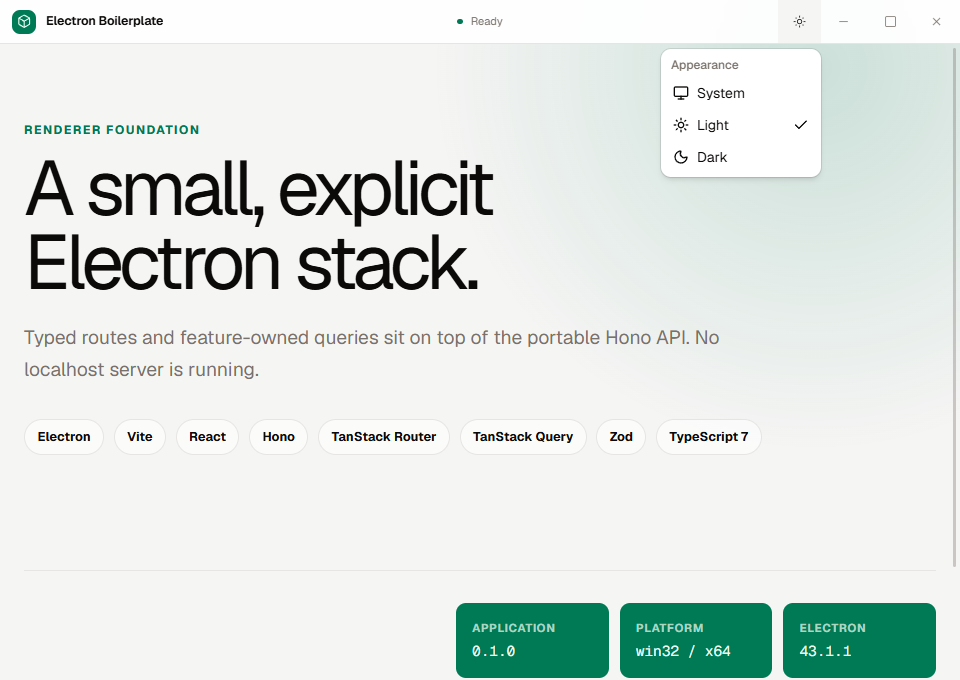

# Electron Boilerplate

<p align="center">
  <strong>A polished Electron foundation you can rename once and start building on.</strong><br />
  React · Vite · strict TypeScript · Hono · shadcn/ui on Base UI
</p>

<p align="center">
  
</p>

This template takes care of the desktop foundation before product work begins: secure process boundaries, typed IPC, embedded application APIs, routing, queries, application chrome, themes, logging, tests, and Windows packaging. The defaults are opinionated, but the repository stays small and feature-owned.

## Why start here

- **One application, one Vite entrypoint.** Doubleshot builds Electron main and preload and manages development startup without a second toolchain.
- **A renderer that stays untrusted.** It is sandboxed and context-isolated, with no raw Electron or Node access. Navigation, popups, webviews, external origins, and browser permissions default to denied.
- **A backend-for-frontend without localhost.** Hono runs in Electron main through `app.fetch()`. A web server adapter remains optional until another client exists.
- **Desktop details already handled.** The template includes single-instance behavior, custom Windows/Linux chrome, native macOS traffic lights, persisted appearance, structured logs, and hardened package fuses.
- **A quality gate that exercises the real boundary.** `pnpm check` reaches from formatting and strict types through the production Electron renderer and live preload → IPC → Hono path.
- **A clean handoff from template to product.** One setup command changes application identity, executable metadata, tests, documentation, workflow artifacts, and icons together.

## Use the template

Create a repository with GitHub's **Use this template** button, then clone it and install the pinned toolchain:

```bash
corepack enable
pnpm install
pnpm dev
```

Requirements: Node.js 22.18 or newer. The `packageManager` field selects pnpm 11.15.1 through Corepack.

## Make it yours

Preview the complete identity change before writing anything:

```bash
pnpm setup:dry-run -- --name "Northstar Desktop" --app-id com.example.northstar
```

Apply it and verify the resulting repository:

```bash
pnpm setup:apply -- --name "Northstar Desktop" --app-id com.example.northstar
pnpm check
```

Package and executable names are derived from the product name. Options can override the package, executable, version, description, author, and icon source. Pass `--icons <file-or-directory>`, or add conventionally named icons under `icons/` or `assets/icons/` for automatic discovery.

The setup command leaves the repository formatted and updates every owned identity surface. See the [personalization manual](docs/project-manual.md#personalization-utility) for all options and recognized icon names.

## What ships

| Area            | Foundation                                                                   |
| --------------- | ---------------------------------------------------------------------------- |
| Desktop         | Electron 43, secure `app://bundle` renderer, single instance, hardened fuses |
| Renderer        | React 19, Vite 8, TanStack Router and Query, Tailwind CSS v4                 |
| Design          | shadcn/ui on Base UI, Lucide, packaged Geist and Geist Mono                  |
| Appearance      | Custom title bar, System/Light/Dark modes, native theme synchronization      |
| Application API | In-memory Hono, Zod contracts, sender-validated IPC                          |
| Operations      | Pino development and packaged logs with redaction and retention              |
| Quality         | Oxfmt, Oxlint, TypeScript 7, Vitest, Playwright, GitHub Actions              |
| Distribution    | electron-builder, unpacked Windows validation, unsigned or signed NSIS       |

## Runtime shape

```text
React renderer
  → narrow typed preload API
  → sender-validated Electron IPC
  → Electron main
  → typed Hono client over app.fetch()
  → local data, filesystem, or remote APIs
```

Product behavior stays with feature owners. Contracts contain boundary schemas and data shapes rather than workflows. Add a Node HTTP adapter only when a web client becomes a real second consumer.

## Everyday commands

| Command             | Purpose                                                           |
| ------------------- | ----------------------------------------------------------------- |
| `pnpm dev`          | Start Vite and development Electron                               |
| `pnpm debug`        | Start development with Doubleshot diagnostics                     |
| `pnpm start`        | Build and launch production Electron                              |
| `pnpm check`        | Run identity, format, lint, type, unit, build, and Electron gates |
| `pnpm package`      | Create an unpacked Windows application                            |
| `pnpm test:package` | Package and smoke-test the unpacked application                   |
| `pnpm dist`         | Create an unsigned NSIS installer                                 |
| `pnpm dist:signed`  | Require signing credentials and create a signed installer         |

Individual gates remain available through `pnpm format`, `pnpm lint`, `pnpm typecheck`, `pnpm test`, `pnpm build`, and `pnpm test:e2e`.

## Platform promise

| Platform | Source runtime             | Distribution                  |
| -------- | -------------------------- | ----------------------------- |
| Windows  | Verified locally and in CI | Unpacked application and NSIS |
| macOS    | Verified in CI             | Not yet claimed               |
| Linux    | Verified in CI with Xvfb   | Not yet claimed               |

macOS and Linux distribution support will require platform metadata, icons, signing boundaries, artifact workflows, and packaged-runtime acceptance. The template does not imply those guarantees from a successful source run.

## Documentation

- [Project manual](docs/project-manual.md) — setup, conventions, architecture decisions, and troubleshooting
- [Windows release guide](docs/releasing.md) — packaging, signing, and publishing boundary
- [Quick plan](docs/plan.md) — current status, security invariants, and optional modules
- [Visual implementation record](docs/plan.html) — the full incremental plan and acceptance history
- [Title-bar design archive](docs/design/titlebar-playground.html) — the three original chrome studies
- [Changelog](CHANGELOG.md) — template release history

## License

Released under the [MIT License](LICENSE).
